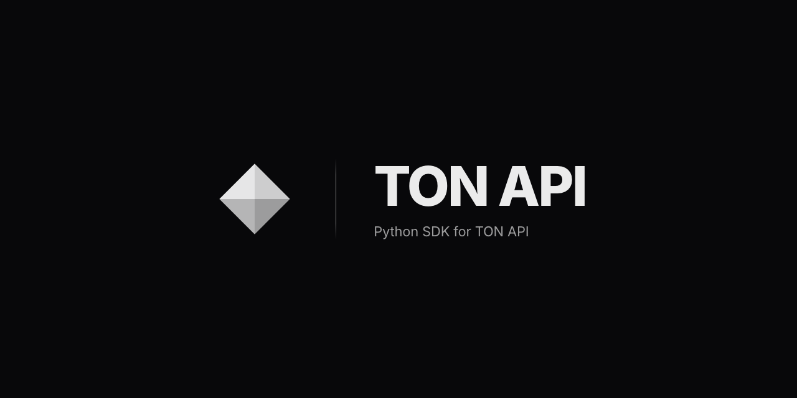

# 📦 PyTONAPI

[](https://ton.org)

[](https://pypi.python.org/pypi/pytonapi)
[](https://github.com/nessshon/tonapi/blob/main/LICENSE)
[](https://tonviewer.com/UQCZq3_Vd21-4y4m7Wc-ej9NFOhh_qvdfAkAYAOHoQ__Ness)




### Python SDK for [TONAPI](https://tonapi.io)

Providing access to TON blockchain data via REST API, real-time streaming, and webhooks.  
An API key is required and can be obtained at [tonconsole.com](https://tonconsole.com/). Documentation available
at [docs.tonconsole.com](https://docs.tonconsole.com/).

> For creating wallets, transferring TON, jettons, etc., use [tonutils](https://github.com/nessshon/tonutils).

**Features**

- **REST API** — accounts, NFTs, jettons, DNS, and more
- **Streaming** — real-time events via SSE and WebSocket
- **Webhooks** — push notifications with event dispatcher

> If this project has been useful to you, consider supporting its development.  
> **TON**: `UQCZq3_Vd21-4y4m7Wc-ej9NFOhh_qvdfAkAYAOHoQ__Ness`

## Installation

```bash
pip install pytonapi
```

## Examples

**REST API**

- [Get account info](examples/get_account_info.py)
- [Get account transactions](examples/get_account_transactions.py)
- [Get NFTs by owner](examples/get_nft_by_owner.py)
- [Get NFTs by collection](examples/get_nft_by_collection.py)

**Streaming** (SSE & WebSocket)

- [SSE subscriptions](examples/streaming_sse.py)
- [WebSocket subscriptions](examples/streaming_websocket.py)

**Webhooks**

- [FastAPI webhook server](examples/webhook_fastapi.py)
- [aiohttp webhook server](examples/webhook_aiohttp.py)

**Transfers** (requires [tonutils](https://github.com/nessshon/tonutils))

- [Transfer TON](examples/transfer_ton.py)
- [Gasless transfer](examples/transfer_gasless.py)

## License

This repository is distributed under the [MIT License](LICENSE).
